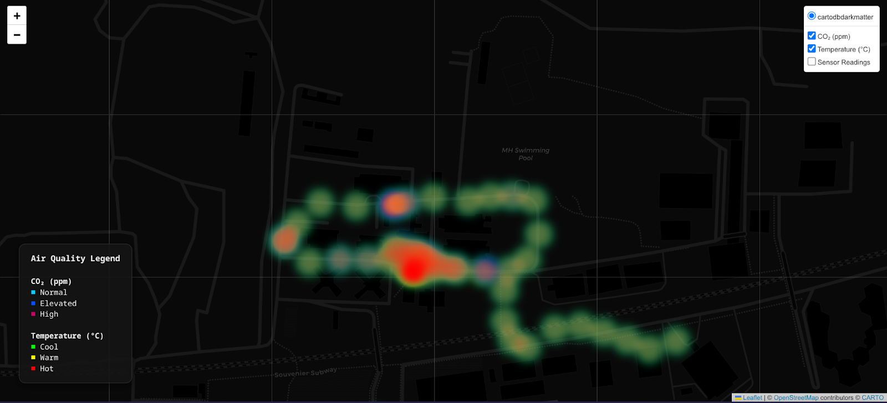

# Edge AQI

A three-tier edge computing system for real-time indoor air quality monitoring and spatial heatmap generation. Sensor readings are collected by an ESP32, forwarded through a GPS-tagged fog node running on a phone, aggregated by a cloud backend, and rendered as an interactive map.

---

## Architecture

```
[ESP32-S3 sensor node]
    DHT11 + MQ135 + OLED
         |
         | HTTP POST (every 5 s, averaged over 20 samples)
         v
[Fog node - Android phone / Termux]
    Flask server
    GPS via termux-location
         |
         | HTTP POST (with lat/lon attached)
         v
[Cloud backend]
    Flask + SQLite
    Buffers 10 readings -> stores average
    Regenerates heatmap on each commit
         |
         v
[air_quality_map.html]
    Interactive Folium heatmap
```

---

## Components

### Firmware (`firmware/`)

Runs on an **ESP32-S3** using PlatformIO and the Arduino framework.

- **DHT11** on GPIO 4 measures temperature and humidity
- **MQ135** on GPIO 7 measures CO2 concentration (ppm) using a Steinhart-Hart curve; calibrated R0 is stored in EEPROM
- **SH1106 128x64 OLED** (I2C) displays live readings
- **NeoPixel LED** on GPIO 48 shows WiFi status: red while connecting, green when connected
- Samples sensors every 250 ms, averages over a 5-second window, then POSTs to the fog node at `http://<gateway_ip>:5000/sensor`
- Reconnects automatically on WiFi drop

**Setup:**

1. Copy `firmware/src/secrets.h.example` to `firmware/src/secrets.h` and fill in your WiFi credentials.
2. Flash with `pio run --target upload`.
3. (Optional) Run `firmware/src/callib.cpp` in clean air to calibrate R0 and store it in EEPROM.

---

### Fog Node (`fognode/`)

A lightweight Flask server intended to run on an **Android phone via Termux**, acting as the mobile edge layer.

- Exposes `POST /sensor` for the ESP32
- Fetches GPS coordinates using `termux-location` (cached for 60 seconds by default)
- Attaches lat/lon to the payload and forwards it to the cloud backend
- Falls back to configurable static coordinates if GPS is unavailable

**Setup:**

```bash
cp .env.example .env   # fill in CLOUD_BACKEND_URL and optionally FALLBACK_LAT / FALLBACK_LON
uv sync
python main.py         # runs on port 5000
```

Environment variables:

| Variable | Default | Description |
|---|---|---|
| `CLOUD_BACKEND_URL` | (required) | Full URL of the backend `/data` endpoint |
| `FALLBACK_LAT` | `11.3410` | Latitude used if GPS fails |
| `FALLBACK_LON` | `77.7172` | Longitude used if GPS fails |
| `GPS_REFRESH_INTERVAL` | `60` | Seconds between GPS polls |

---

### Backend (`backend/`)

A Flask API that stores readings in SQLite and generates an interactive heatmap after each batch.

- Accepts `POST /data` with `temperature`, `humidity`, `co2_ppm`, `latitude`, `longitude`
- Buffers incoming readings; every 10 readings are averaged and committed as one row
- Calls `map.py` after each commit to regenerate `air_quality_map.html`
- Additional routes: `GET /readings`, `GET /stats`, `GET /health`

**Setup:**

```bash
uv sync
python main.py   # runs on port 5001
```

To run under gunicorn:

```bash
gunicorn -w 1 -b 0.0.0.0:5001 main:app
```

---

## Heatmap

The backend generates `backend/air_quality_map.html` automatically after each batch of readings. Open it in any browser.

The map has three toggleable layers:
- **CO2 heatmap** (cyan to pink) -- shown by default
- **Temperature heatmap** (green to red)
- **Sensor markers** with popups showing raw CO2, temperature, humidity, coordinates, and timestamp



To regenerate the map manually from the database:

```bash
cd backend
python map.py
```

---

## Project Structure

```
firmware/       ESP32-S3 PlatformIO project
fognode/        Phone-based fog node (Flask, Termux)
backend/        Cloud backend (Flask, SQLite, Folium)
assets/         Static assets (map.png preview)
```

---

## Dependencies

| Layer | Key libraries |
|---|---|
| Firmware | DHT sensor library, Adafruit NeoPixel, U8g2 |
| Fog node | Flask, requests, python-dotenv |
| Backend | Flask, folium, pandas, numpy, SQLAlchemy, gunicorn |
